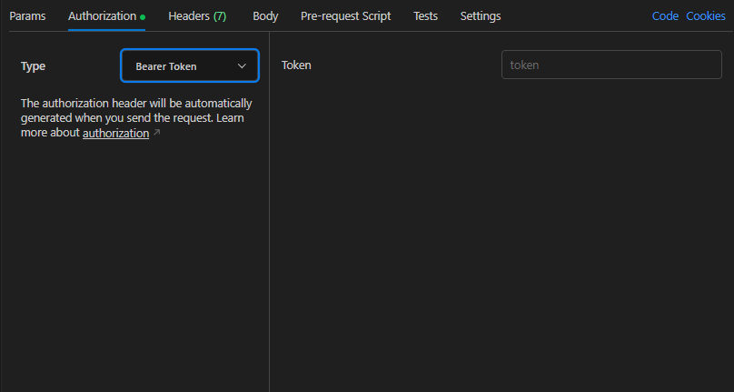

# Backend Project README

## Assignment Details
Task is to create the following APIs:
1. **User**: Implement endpoints for Registering, Logging in, Logging out, and Editing user information.
2. **Product**: Implement endpoints for Creating a Product and Getting all Products.
3. Integrate `jsonwebtoken` for authentication.

## Instructions
1. Utilize `Express.js` and `Typescript` for the project.
2. Employ `MongoDB` as the database.

## Getting Started
Follow these steps to get the project up and running on your local machine:

### Prerequisites
- `Node.js` and `npm` installed on your system.
- `Typescript` installed globally.
- `Typescript Compiler` installed globally, `npm i -g tsc`.
- `MongoDB` running locally or cloud instance.

### Installation
1. Clone the repository: `git clone <repository-url>`
2. Navigate to the project directory: `cd <project-folder>`
3. Install dependencies: `npm install`

### Configuration
1. Set up a `.env` file in the root (`dist` folder) directory of the project.
2. Configure the following environment variables in the `.env` file:
   - `JWT_SECRET`: Specify the port for running the server.
   - `DATABASE_URL`: Provide the connection URL for MongoDB.

### Running the Server
1. Execute the build command: `tsc`
2. Navigate to the `dist` folder: `cd dist`
3. Start the server: `node index.js`

### Testing the APIs
You can test the APIs using tools like Postman. Here are the endpoints available:

#### Adding JWT Token in Postman
- Add jwt token in the header with key `Authorization` and value `Bearer <token value>` in Postman.
- The token is generated when you log in or register a user.

#### User Endpoints
- **POST /auth/register**: Register a new user.
- **POST /auth/login**: Log in with existing user credentials.
- **PATCH /auth/edit**: Edit user information.

#### Product Endpoints
- **POST /product/new_product**: Create a new product.
- **GET /product/products**: Get all products.